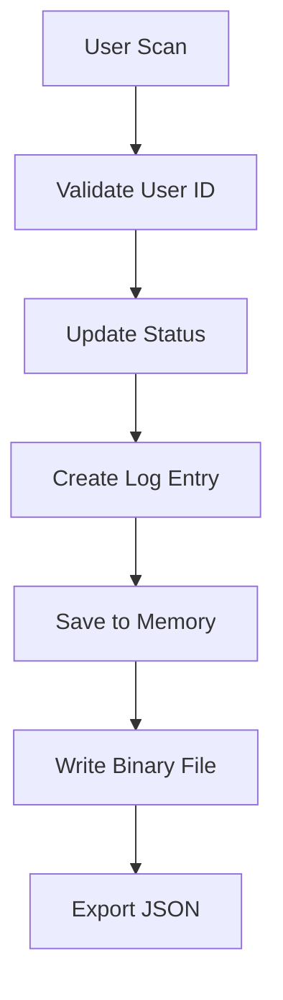

# 🏫 RFID Lab Access Control System

A comprehensive **RFID-based laboratory access control system** built in C++ for managing user authentication, attendance tracking, and access logging in educational or corporate lab environments.

## 📋 Table of Contents

- [Features](#-features)
- [System Architecture](#-system-architecture)
- [Installation](#-installation)
- [Usage](#-usage)
- [Project Structure](#-project-structure)
- [Data Management](#-data-management)
- [Security Features](#-security-features)
- [Contributing](#-contributing)
- [License](#-license)

## ✨ Features

### 🔐 **Dual Access Modes**
- **Admin Panel**: Full system management and configuration
- **User Mode**: Simple RFID card scanning interface

### 👥 **User Management**
- Add new users with validation (Students, Staff, Faculty)
- Real-time user status tracking (IN/OUT)
- Comprehensive user directory with role-based organization

### 📊 **Advanced Logging & Analytics**
- Real-time scan logging with timestamps
- User-specific log searches and filtering
- Daily attendance reports and analytics
- Chronological scan history with sorting

### 💾 **Robust Data Persistence**
- **Binary format** for efficient storage and fast loading
- **JSON export** for data portability and integration
- Automatic data backup and recovery
- Data integrity validation

### 🛡️ **Security & Validation**
- Secure admin authentication system
- Input validation and sanitization
- Confirmation prompts for destructive operations
- Error handling and graceful failure recovery

## 🏗️ System Architecture

```
┌─────────────────┐    ┌─────────────────┐    ┌─────────────────┐
│   Main System   │────│  RFID Scanner   │────│   Data Layer    │
│   (main.cpp)    │    │  (RFIDSystem)   │    │ (Binary + JSON) │
└─────────────────┘    └─────────────────┘    └─────────────────┘
         │                        │                        │
         ▼                        ▼                        ▼
┌─────────────────┐    ┌─────────────────┐    ┌─────────────────┐
│  User Interface │    │   User & Log    │    │   File System   │
│   Admin/User    │    │   Management    │    │   Operations    │
└─────────────────┘    └─────────────────┘    └─────────────────┘
```

## 🚀 Installation

### Prerequisites
- **C++11** or higher compiler (GCC, Clang, MSVC)
- Standard C++ libraries
- POSIX-compatible system (for directory operations)

### Build Instructions

1. **Clone the repository**
   ```bash
   git clone https://github.com/yourusername/rfid-lab-system.git
   cd rfid-lab-system
   ```

2. **Compile the project**
   ```bash
   # Using g++
   g++ -std=c++11 -Wall -Wextra -O2 *.cpp -o rfid_system

   # Or using make (if Makefile provided)
   make
   ```

3. **Run the system**
   ```bash
   ./rfid_system
   ```

## 📖 Usage

### Initial Setup

1. **Launch the application**
2. **Admin Login** (Default credentials):
   - Username: `testAdmin`
   - Password: `alprog05`

### Admin Operations

| Feature | Description |
|---------|-------------|
| **Add New User** | Register users with ID validation and role assignment |
| **Scan Cards** | Process RFID card scans for IN/OUT tracking |
| **Search Logs** | Find specific user activity logs |
| **View Reports** | Generate daily attendance and status reports |
| **Data Export** | Export system data to JSON format |
| **System Maintenance** | Clear logs, backup data, system reset |

### User Mode Operations

- **Simple Interface**: Streamlined card scanning for end users
- **Real-time Feedback**: Immediate scan confirmation and status updates
- **Error Handling**: Clear error messages for invalid operations

### Sample Workflow

```bash
# 1. Admin adds a new user
Add User: ID=STU001, Name=John Doe, Role=Student

# 2. User scans RFID card
Scan: STU001 → Status: IN (2024-01-15 09:30:00)

# 3. Later scan changes status
Scan: STU001 → Status: OUT (2024-01-15 17:45:00)

# 4. Admin views daily report
Daily Report: STU001 - 2 scans, Last: OUT
```

## 📁 Project Structure

```
rfid-lab-system/
├── 📄 main.cpp              # Main application entry point & UI
├── 🏗️ RFIDSystem.h          # System class declaration
├── ⚙️ RFIDSystem.cpp        # Core system implementation
├── 👤 User.h                # User data structure
├── 📋 ScanLog.h             # Scan logging structure
├── 📁 data/                 # Auto-generated data directory
│   ├── system_data.bin      # Binary data storage
│   └── system_data.json     # JSON export file
├── 📖 README.md             # Project documentation
└── 📜 LICENSE               # License file
```

### Core Components

| Component | Responsibility |
|-----------|----------------|
| **RFIDSystem** | Main system logic, user management, data persistence |
| **User** | User data structure with validation |
| **ScanLog** | Timestamp-based logging with sorting capabilities |
| **Main Interface** | Console-based UI with menu systems |

## 💾 Data Management

### Storage Formats

#### Binary Storage (`system_data.bin`)
- **Efficient**: Fast read/write operations
- **Compact**: Minimal file size
- **Versioned**: Future compatibility support
- **Structure**: Users → Logs → Status mapping

#### JSON Export (`system_data.json`)
```json
{
  "users": [
    {
      "id": "STU001",
      "name": "John Doe",
      "role": "student",
      "status": "OUT"
    }
  ],
  "daily_logs": [
    {
      "user_id": "STU001",
      "user_name": "John Doe",
      "action": "IN",
      "timestamp": "2024-01-15 09:30:00",
      "unix_timestamp": 1705304200
    }
  ],
  "summary": {
    "total_users": 1,
    "total_scans": 2,
    "export_time": "2024-01-15 18:00:00"
  }
}
```

### Data Flow



## 🔒 Security Features

### Input Validation
- **User ID**: 3-10 alphanumeric characters
- **Names**: 2-50 characters, letters and common punctuation
- **SQL Injection**: Protection through parameterized inputs
- **Buffer Overflow**: String length validation

### Access Control
- **Admin Authentication**: Username/password verification
- **Role-based Permissions**: Different access levels
- **Confirmation Dialogs**: For destructive operations
- **Session Management**: Secure login/logout flow

### Data Integrity
- **File Versioning**: Backward compatibility checks
- **Error Recovery**: Graceful handling of corrupted data
- **Backup Strategy**: Dual-format storage (Binary + JSON)
- **Validation**: Cross-reference user data consistency

## 🎯 Key Algorithms

### Time Complexity Analysis
| Operation | Time Complexity | Space Complexity |
|-----------|----------------|------------------|
| User Lookup | O(n) | O(1) |
| Log Search | O(n) | O(k) where k = matching logs |
| Log Sorting | O(n log n) | O(n) |
| Data Save | O(n + m) | O(1) where n=users, m=logs |

### Optimization Features
- **Lazy Loading**: Data loaded on demand
- **Efficient Sorting**: STL algorithms for log chronology
- **Memory Management**: RAII principles throughout
- **File I/O**: Buffered operations for performance

## 🔧 Configuration

### Admin Credentials
Default admin credentials can be modified in `main.cpp`:
```cpp
const string ADMIN_USERNAME = "testAdmin";
const string ADMIN_PASSWORD = "alprog05";
```

### File Paths
Data directory and file paths are configurable:
```cpp
// In RFIDSystem.cpp
const string DATA_DIR = "data";
const string BINARY_FILE = "data/system_data.bin";
const string JSON_FILE = "data/system_data.json";
```

## 🧪 Testing

### Test Scenarios
1. **User Management**: Add, validate, duplicate handling
2. **Scan Operations**: IN/OUT status transitions
3. **Data Persistence**: Save/load operations
4. **Error Handling**: Invalid inputs, file I/O errors
5. **Edge Cases**: Empty databases, corrupted files

### Manual Testing Checklist
- [ ] Admin login with correct/incorrect credentials
- [ ] Add users with various ID formats
- [ ] Scan existing/non-existing user IDs
- [ ] Generate reports with/without data
- [ ] Export data and verify JSON format
- [ ] System recovery after data corruption

## 🔮 Future Enhancements

### Planned Features
- [ ] **Database Integration**: MySQL/PostgreSQL support
- [ ] **Web Interface**: REST API with web dashboard
- [ ] **Real RFID Hardware**: Arduino/Raspberry Pi integration
- [ ] **Multi-language Support**: Internationalization
- [ ] **Advanced Analytics**: Charts, trends, insights
- [ ] **Email Notifications**: Attendance alerts
- [ ] **Mobile App**: iOS/Android companion app

### Technical Improvements
- [ ] **Unit Testing**: Comprehensive test suite
- [ ] **Configuration Files**: External config management
- [ ] **Logging Framework**: Structured logging with levels
- [ ] **Performance Profiling**: Optimization opportunities
- [ ] **Documentation**: API documentation with Doxygen

⭐ **Star this repository** if you find it helpful!

📢 **Share** with others who might benefit from this system!

🐛 **Report issues** to help improve the project!
